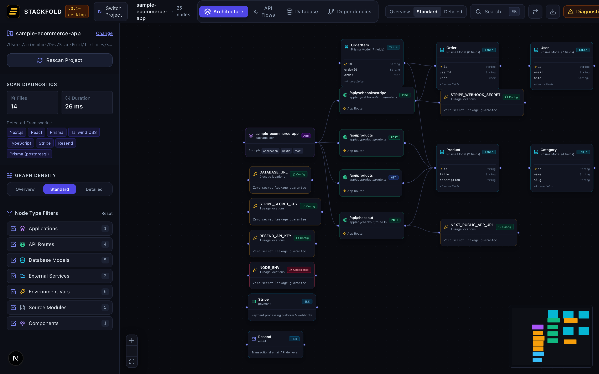
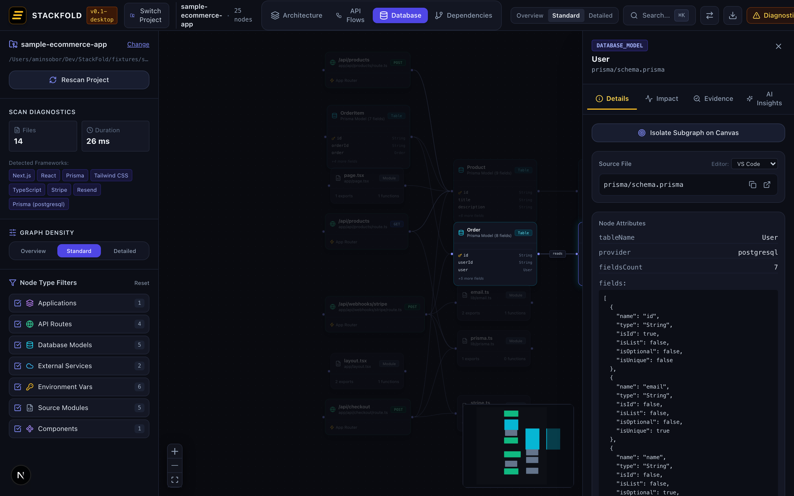
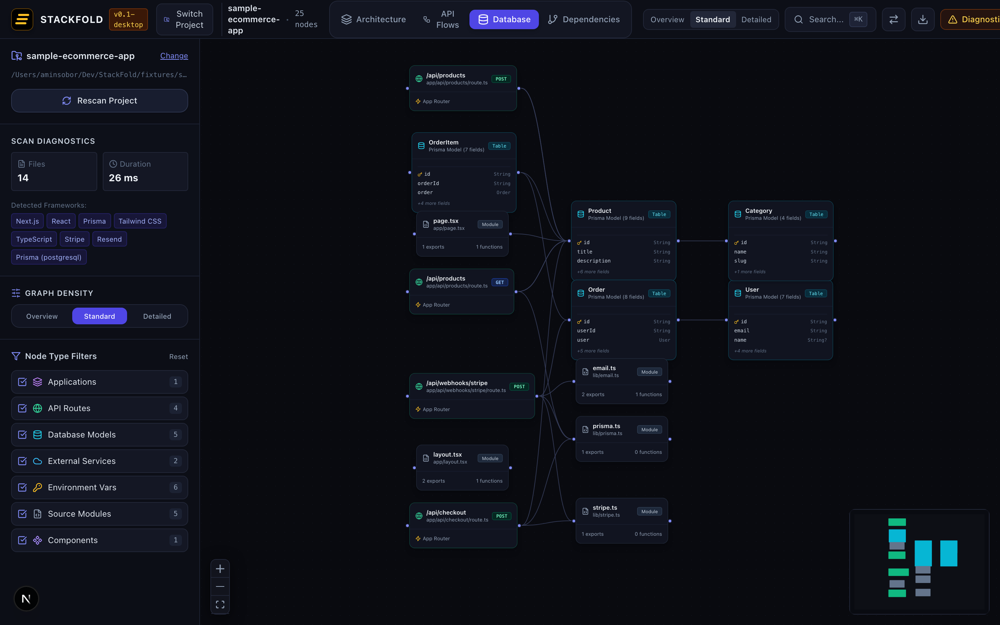

<div align="center">


# Stackfold

**Visual project intelligence and architectural control center for modern codebases.**

[](https://github.com/AminSS99/StackFold/actions/workflows/ci.yml)
[](https://github.com/AminSS99/StackFold/releases)
[](LICENSE)

</div>

---

Stackfold scans software repositories and turns them into interactive, high-fidelity system maps. It answers the fundamental question:

> **"How does this project actually work, and what will be affected if I change something?"**

Stackfold is **not** a code generation tool or a conversational coding assistant. It is a local-first architectural context engine and change-impact intelligence layer designed for software engineers, tech leads, and security reviewers.

---

## Visual Overview

### 1. Interactive Architecture Map
Deterministic layout mapping applications, API routes, database schemas, and external services with DAG-based dependency flows:



### 2. Deep Node Inspector & Change-Impact Traversal
Inspect granular code evidence, source line ranges, and compute downstream blast radius before altering code:



### 3. Database Schema & Entity Relationships
Visual relational mapping parsed directly from your schema definitions:



---

## Key Features

- **Multi-View System Mapping**: Switch instantly between four architectural lenses:
  - **Architecture View**: High-level topology of packages, services, and route boundaries.
  - **API Flows**: Request endpoints, HTTP methods (`GET`, `POST`, `PUT`, `DELETE`), and backend handlers.
  - **Database Relations**: Data models, relational foreign keys, and schema declarations.
  - **Package Dependencies**: Workspace inter-dependencies across monorepo boundaries.
- **Blast-Radius Impact Analysis**: Select any node to calculate direct and transitive upstream and downstream dependencies.
- **Deterministic Evidence**: Every discovered entity is backed by traceable evidence (source file path, exact line/column range, detector rule, and code snippet).
- **Standalone Native Desktop**: Native macOS desktop application (Tauri 2.x) with OS folder pickers, background cancellation, and zero orphaned processes.
- **Local-First & Zero Secrets**: Runs 100% locally. Private environment values and credentials are never read, stored, logged, or exposed.

---

## Current Supported Ecosystem

Stackfold analyzes real codebases using deterministic AST and schema parsing. Support is verified against the following technologies:

| Category | Verified Technologies |
| :--- | :--- |
| **Languages** | TypeScript (`.ts`, `.tsx`), JavaScript (`.js`, `.jsx`, `.mjs`, `.cjs`) |
| **Frameworks** | Next.js 13/14/15 (App Router routes & Pages Router API endpoints) |
| **Databases & ORMs** | Prisma (`schema.prisma` models, scalar fields, relations, enums) |
| **Monorepo Tools** | pnpm workspaces (`pnpm-workspace.yaml`), Lerna (`lerna.json`) |
| **External Services** | Stripe, Resend, Supabase client initializations |
| **Environment Configs** | `.env.example`, `process.env.*`, `import.meta.env.*` reference sites |

*(Note: We only claim support for technologies covered by automated test suites. See [ROADMAP.md](ROADMAP.md) for upcoming framework support.)*

---

## Security & Privacy Model

Stackfold is built around a strict local-first security boundary:

1. **Local Analysis**: Code scanning executes entirely on your machine. Source code, ASTs, and architecture graphs are never transmitted over the internet.
2. **Zero Secrets Ingestion**: Active environment files (`.env`, `.env.local`, `.env.production`) are excluded by default. Scanner detectors extract variable names only—never secret values.
3. **Path Traversal & System Root Defense**: The desktop application canonicalizes paths and rejects system root directories (`/`, `/System`, `/private`, `/etc`, `/var`, `/usr`, `C:\Windows`) with `FORBIDDEN_SYSTEM_ROOT`.
4. **Sandboxed Webview**: The desktop shell enforces an active Content Security Policy (CSP) with typed Tauri IPC invoke barriers.
5. **Clean Process Lifecycle**: Scanner sidecars are managed with atomic PID tracking to terminate child processes cleanly on cancellation or window exit.

For details, read our [SECURITY.md](SECURITY.md).

---

## Installation & Running

### Desktop Application (macOS)

1. Download the latest `Stackfold_0.1.0_aarch64.dmg` from the release artifacts.
2. Open the disk image and drag `Stackfold.app` into your `/Applications` folder.
3. **Gatekeeper Notice (Early Alpha):** Because this early alpha release is not yet notarized by Apple, macOS Gatekeeper may present a security warning on first open. To open:
   ```bash
   xattr -cr /Applications/Stackfold.app
   ```
   *Alternatively, right-click `Stackfold.app`, hold the `Option` key, and click **Open**.*

---

## Development Setup

### Prerequisites
- **Node.js**: `v20+` or `v22+`
- **pnpm**: `v10+`
- **Rust toolchain**: `1.80+` and `cargo` (for desktop build and test)

### Getting Started

```bash
# 1. Clone the repository
git clone https://github.com/AminSS99/StackFold.git
cd StackFold

# 2. Install dependencies with frozen lockfile
pnpm install --frozen-lockfile

# 3. Run the Next.js web application (http://localhost:3000)
pnpm dev:web

# 4. Run the native Tauri desktop application
pnpm dev:desktop
```

### Exact Verification Commands

```bash
# Strict TypeScript checking across packages and Cargo check
pnpm typecheck

# Full automated test suites (Vitest + Cargo tests)
pnpm test

# Linters (ESLint + Cargo Clippy with -D warnings + cargo fmt check)
pnpm lint

# Production compilation (Web export + Sidecar bundle)
pnpm build:web

# Native desktop production bundle (.app & .dmg on macOS)
pnpm build:desktop
```

---

## Project Status & Known Limitations

**Status:** Early Alpha (`v0.1.0`).

Stackfold is functional and self-hosting (it scans its own repository cleanly), but has known limitations:

- **Unsigned Desktop Builds**: macOS builds currently require removing the quarantine attribute (`xattr -cr`) due to lack of Apple Developer ID signing.
- **Language Scope**: Currently supports JavaScript and TypeScript codebases. Python, Go, and Rust backends are planned for future minor versions.
- **Static AST Heuristics**: Dynamic runtime route mounting (e.g. meta-programmed Express routers) or non-standard file structures may require explicit path mapping.
- **Large Repository Scaling**: Repositories with over 15,000 files will trigger file-count caps to protect desktop memory limits.

---

## Documentation & Community

- [DOCUMENTATION.md](DOCUMENTATION.md) — The complete user manual, feature guide, and operational reference.
- [CONTRIBUTING.md](CONTRIBUTING.md) — Setup guide, detector tutorial, and fixture conventions.
- [ARCHITECTURE.md](ARCHITECTURE.md) — Technical deep dive and data pipeline design.
- [ROADMAP.md](ROADMAP.md) — What we're building next.
- [CODE_OF_CONDUCT.md](CODE_OF_CONDUCT.md) — Community standards.

---

## License

Stackfold is preparing for public open-source release under **Apache-2.0** or **MIT**. See [LICENSE](LICENSE) for details.
